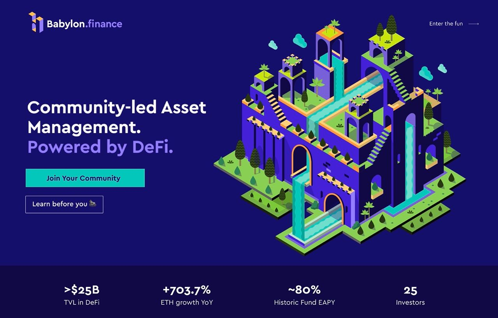

# Introduction

Welcome to Babylon! Babylon is a community-led asset management protocol that enables users to invest in DeFi together. It's built on the Ethereum network and it's non-custodial, transparent, permission-less, and governed by the community.

Babylon has a two-layer governance system. The protocol is managed by the holders of the governance token, $BABL, which is used to vote on changes to the protocol and decide on the best use of the protocol treasury.&#x20;

Babylonians can create investment communities (called "Gardens") and invite people to deposit capital. Members participate in the garden by joining the telegram chat, suggesting investment Strategies and voting on Strategies. Members receive rewards based on their contributions.

You can read our introductory announcement [here](https://medium.com/babylon-finance/introducing-babylon-finance-8199fa89f918).
