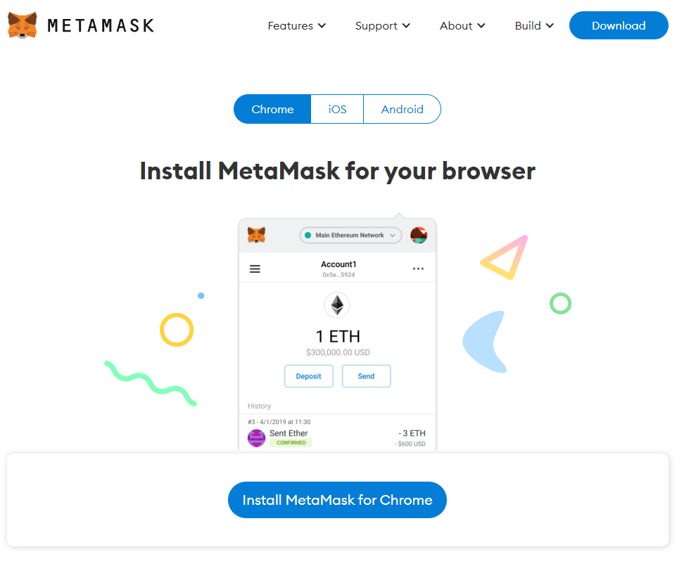

# 1. Funding a Web3 Wallet:

Babylon Finance is a decentralized application (Dapp) running on top of the Ethereum blockchain. Sometimes we call these Dapps "Web3" and you will need a Web3 wallet to interact with them.&#x20;

**Step 1:** Download Metamask from Metamask.io

**Step 2:** Closely follow Metamask's instructions to safely set up, secure, and backup your private key phrase.&#x20;


Reminder: Never input your seed phrase into anything. A legitimate Web3 protocol will never ask you for your seed phrase. Never give your seed phrase to someone else.


**Step 3:** Use your preferred fiat on-ramp exchange to fund your new Web3 wallet with Ether (ETH). You will need ETH in your wallet to pay for your transactions.

**Step 4:** Acquire the reserve currency to want your investments to be denominated in. If you want to invest stablecoins like USDC or USDT you will need to acquire it from an exchange.

Popular Crypto Exchanges:&#x20;

* [https://www.coinbase.com/](https://www.coinbase.com/) - Centralized
* [https://www.kraken.com/](https://www.kraken.com/) - Centralized&#x20;
* [https://www.binance.com/en](https://www.binance.com/en) - Centralized&#x20;
* [https://ftx.com/](https://ftx.com/) - Centralized&#x20;
* [https://uniswap.org/](https://uniswap.org/) - Decentralized
* [https://www.sushi.com/](https://www.sushi.com/) - Decentralized&#x20;

