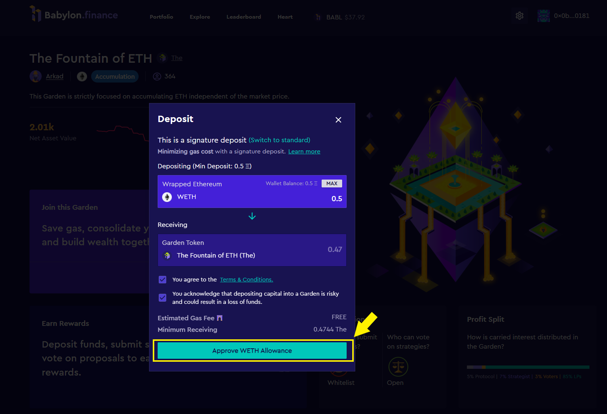

# 2. Joining a Garden:

Once you have a Web3 wallet installed on your browser you can start exploring different gardens.&#x20;

**Step 1:** When you get to the landing page of Babylon Finance you will need to launch the application with the button at the top right of the page.&#x20;

**Step 2:** After launching the application, press the same button again, which this time prompts you to connect your wallet.&#x20;

**Step 3:** Select Metamask and a pop-up will prompt you to select an account you want to connect to Babylon with. Select the account you funded in [User Guide 1. Funding a Web3 Wallet.](1.-funding-a-web3-wallet.md)&#x20;

**Step 4:** Search for the garden you want to join. In our example we will be joining The Fountain of ETH which will be right on the front page, but don't forget to check out [the Leaderboard](https://www.babylon.finance/leaderboard) to see Babylon's top performing gardens.

**Step 5:** Take a moment to explore the garden parameters, strategies, charts, metrics, and everything else to ensure its risk profile is in line with your risk appetite before pressing the Deposit to Join button.&#x20;

**Step 6:** A deposit pop-up will appear and the first thing you'll notice is Babylon uses [Signature Deposits](https://docs.babylon.finance/getting-started/faq#what-is-a-signature-based-transaction) to reduce gas costs for its users. In our example, we have a Web3 wallet funded with ETH, but the reserve currency for The Fountain of ETH is actually WETH, or Wrapped Ether. Thankfully Babylon makes it easy to purchase (or wrap) any reserve currency supported by the platform. Click the link to "Buy WETH."&#x20;

**Step 7:** Upon clicking the link to "Buy WETH" a new page will open on your browser taking you to [Matcha.xyz](https://matcha.xyz/), a decentralized exchange aggregator. Matcha will allow you to convert (or wrap) ETH to WETH at a 1:1 ratio. Enter your desired deposit amount into the "You Pay" field, click "Review Order," and follow the same Metamask prompts from Step 3 to connect your wallet.

Step 8: After connecting your wallet and reviewing the conversion rate, press "Place Order" and a metamask pop-up will appear asking you to confirm your order. Keep in mind gas prices and review your transaction a final time before pressing "Confirm."&#x20;

**Step 9:** You can click "View Transaction" to be taken to Etherscan.io where you can check on the progress of your order; otherwise, simply wait until Matcha confirms your transaction was a "Success!," and head back over to The Fountain of ETH Deposit page on Babylon.

**Step 10:** After returning to the deposit page, take a moment to review and agree to the [Terms and Conditions](https://www.babylon.finance/terms), as well as the acknowledgment related to risk. Babylon is non-custodial and does not have access to your funds; however, it will need your permission to deposit funds into a garden. After reviewing the terms and risks, enter your desired deposit amount and click "Approve WETH Allowance."

**Step 11:** Approve the transaction in metamask, and wait for it to be confirmed.

**Step 12:** When you return to the deposit page, you may be prompted to refresh because the gas price you were quoted before approving WETH on Babylon is now out of date. Press Refresh and then select "Deposit by Signature" to continue.

**Step 13:** When you press the deposit button, another metamask pop-up will appear, this time asking for your signature. This operation will not cost you any gas, and will deposit your WETH into the Fountain of ETH. Press the "Sign" button to approve the request and wait for the success prompt from Babylon.&#x20;

**Step 14:** That's it! You're done! You've successfully joined your first garden on Babylon Finance! The only thing left to do is engage with your garden community by clicking the "Garden Chat" link at the top of the page to be taken to your gardens private Discord channel.

**Wrapping Up:** When you enter the Discord community you will be able to discuss strategies and market conditions with your fellow investment club members in order to make the best decisions for the garden.&#x20;

Leverage the wisdom of your community and help each other build wealth and invest in DeFi together! We look forward to seeing you [in Discord](https://discord.com/invite/babylon). Welcome to Babylon!
