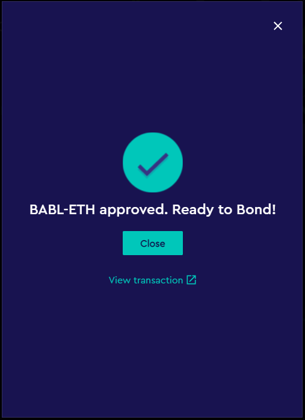

# 7. Bonding ETH/BABL:

**Step 1:** Start on the [https://www.babylon.finance/](https://www.babylon.finance/) landing page.

**Step 2:** Click the "Heart" link at the top of the page.

**Step 3:** On the Heart of Babylon page, click the Bond button on the banner at the top of the page.

.png>)

**Step 4:** Click BABL-ETH pair.

**Step 5:** On this pop-up you will click "Need BABL-ETH?" to be taken to [gamma.xyz](https://www.gamma.xyz/). Babylon's active liquidity management partner.&#x20;

**Step 6:** On Gamma's landing page, connect your wallet by pressing the button on the top right of the page and then click "Provide Active Liquidity"&#x20;

**Step 7:** On the Gamma Dashboard, find and select the ETH-BABL LP pair in the list.

**Step 8:** With ETH-BABL pair selected, a new banner will appear near the top of the list. Click on "Get LP Tokens" to continue.&#x20;

**Step 9:** An alert will pop-up, select "Get LP Tokens" again to continue.&#x20;

**Step 10:** Enter the amount of BABL tokens you wish to add as LP and the equivalent amount of ETH you need will auto populate for you. Check that these values are in line with your expectations and understanding of the BABL price, then click "Next."

**Step 11:** You will need to give Gamma permissions to spend your WETH to add BABL-ETH to liquidity. Click "Approve WETH" and follow the Metamask prompts.

**Step 12:** After approving WETH for spending on Gamma, you will need to do the same for BABL. Click "Next," then "Approve BABL," and follow the Metamask prompts like before.

**Step 13:** With WETH & BABL approved, you are ready to add liquidity to Gamma, which will add liquidity to Uniswap V3. Click "Next," then "Deposit," then confirm the action in Metamask once again.

**Step 14:** If your transactions succeeds, you will get an alert from Gamma informing you that you have successfully deposited WETH & BABL tokens into liquidity, and received Gamma LP tokens in return. You will use these Gamma LP tokens to bond them to the heart for a 5% discount on your deposit. You can head back to the Heart of Babylon page, or simply click "Go to Babylon" on the alert pop-up to be taken there.

**Step 15:** There is one last token approval required in order to bond LP tokens. You will need to give Babylon permission to deposit your Gamma LP tokens into the Heart of Babylon. Back on the Bonding page from Step 5, you will see how much hBABL you will receive for your Gamma LP tokens. Confirm these values are in line with your expectations and click "Approve BABL-ETH Allowance" to continue.&#x20;

**Step 16:** Follow the Metamask prompts and wait for confirmation. After your transaction succeeds, close the pop-up.

**Step 17:** You may notice a prompt telling you that the gas price is outdated. Press this button to refresh gas prices then select "Bond BABL-ETH by signature" and sign the transaction through Metamask.

**Step 18:** Now you just need to wait for Babylon to process your gasless signature deposit and you're done! You've successfully sold liquidity to Babylon for a discount on yield bearing BABL governance tokens, hBABL. You can monitor your position on the heart page or you can go to [https://www.babylon.finance/portfolio](https://www.babylon.finance/portfolio) and see everything in one place. Don't forget to vote, gas free, for your favorite garden to benefit from the Heart fee distributions and any BIP's that have been proposed.&#x20;
