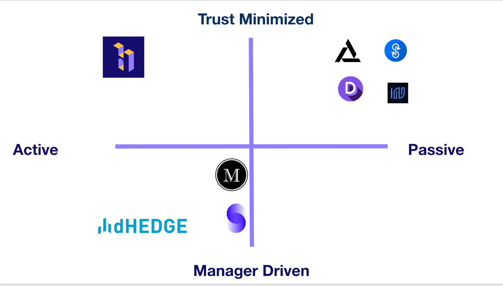

# Litepaper

## Abstract

Babylon is an Ethereum-based protocol that offers community-led asset management.

There are a lot of investment opportunities in DeFi but very few people that know how to take advantage of them. We believe this ever-expanding universe of opportunity is best served by a community-first approach.

Babylon enables users to create investment communities (called "Gardens") and invite members to deposit capital, suggest investment strategies, vote, and earn rewards. Users can join Gardens with an investment thesis that matches their risk, time, and liquidity preferences.

Babylon integrates with a number of different DeFi protocols to empower members with the tools they need to grow their assets under management.

### Mission

We are witnessing the end of a 30-year secular downtrend in interest rates. As a consequence, bonds are no longer a viable hedge for portfolios. At the same time, equities are at an all-time high in terms of P/E ratios. Central banks are increasing the money supply faster than ever. Inflation looms on the horizon.&#x20;

.png>)

We believe crypto assets are poised to become the best-performing asset class over the next two decades.

**We want to bring everyone access to this generational opportunity.** We are rethinking asset management from scratch. We are creating an ecosystem that rewards the participants who support the best investment ideas.

### Motivation

You can read more about the principles behind Babylon [in our Medium post](https://medium.com/babylon-finance/babylons-finance-litepaper-8fdb57770615). TLDR below.

* **In a world starved for yield**, DeFi can help investors capture the convexity of the returns of the crypto asset class for the next decade. We want to give investors a way to find attractive risk-adjusted returns in a world where returns are pushed farther and farther in the risk curve. (e.g zero interest rates, bond yields inching negative, equity valuations at an all-time high).
* **Non-custodial.** Users retain ownership over their capital. The protocol, founding team, and other users cannot withdraw their capital.
* **Decentralized asset management**. Everyone can create their own Gardens. Users can become members of a Garden by depositing capital.&#x20;
* The protocol is designed to encourage **long-term holdings over short-term holdings**. It incentivizes long-term holdings with more rewards in the governance token ($BABL).
* **DeFi Together.** Members of a Garden form around an investment thesis and cooperatively decide where to allocate the group's capital for the common good.
* **Democratize access to investment**. Give everyone the chance to start their own Garden.
* **Every asset will eventually be a crypto asset.** Babylon will eventually offer every asset class. We are convinced that eventually, all asset classes are going to be tokenized and available through public blockchains. Synthetix and its tokens that track oil, gold, or the S\&P are an early example of this.
* **Gateway to DeFi**. Protocol details are hidden from the user, providing an **understandable blockchain agnostic interface and messaging**. Aggregator on the frontend, protocol on the backend.
* **Participants with skin in the game and shared upside.** Improve on the 2/20 structure from traditional hedge funds. Compensate and attract the best Strategists with strong incentives to be able to offer the best investment ideas in the world.

### Differentiation with other asset management protocols

Currently, there are two different kinds of asset management protocols.&#x20;

On one side, you have the ones that are passive like Yearn, DPI, Indexed.finance or Inverse.finance. They are trust-minimized and the strategies are coded in the smart contracts, therefore passive.&#x20;

On the other side, there are protocols like Enzyme, Set or dHedge that offer actively managed funds where a manager controls the investment decisions.

We believe there is a huge gap in the market for **actively managed investment communities**.

## Protocol overview

The Babylon protocol is an Ethereum-based protocol that enables the following:

* **ERC-20 Compatibility**. Participation in Gardens is implemented using the ERC-20 token standard. Garden Tokens are trustless and reissued/redeemed when entering/exiting the Garden.
* **Skin in the game**. Participants suggest Strategies and other members of the same Garden can upvote or downvote them. The member that created the Strategy plus the members that voted on the strategy get rewarded based on its performance. A member needs to stake a % of his participation in the Garden to be able to create a Strategy.
* **Codeless Strategy Creation**. A member can craft a Strategy combining different Defi protocols through our user interface. No need to code.
* **Protocol Fees**. To allow for protocol sustainability, the protocol may charge additional small fees based on performance and capital allocated to Strategies.
* **Governance Token ($BABL- ERC-20)**. Treasury, protocol fees, integrations, max performance fees, and reserve assets of the protocol will be controlled by the governance token holders. More info in the [governance section](./#governance).
* **Participation Rewards**. Participants will receive governance tokens based on their contributions to the protocol. More details in the [Participation Rewards Program section](../../babl/mining.md).
* **Asset Consolidation**. Investors only need to deposit a single asset (known as the reserve asset). Upon deposit and upon withdrawal, the protocol will automatically consolidate the assets to facilitate P\&L and accounting for the members.
* **Asset Management Innovation.** Thought from first principles. Now that Ethereum gives us strong coordination tools, there is no fundamental reason why groups need to rely on a single manager figure.
* **Multi-Protocol**. Babylon integrates with many DeFi protocols and exchanges. More information about the [integrations here](../integrations.md).

### Use Cases

Investors will be able to find the best Strategies in the space by participating in Gardens that focus on different aspects of the crypto market.&#x20;

Over the years, crypto insiders are always receiving questions from friends and family about how to get started and invest in the space. It is not scalable to educate every single person one on one. Babylon is designed to create a multi-sided marketplace where many different members can benefit from the knowledge of DeFi experts or Strategists.

* **If you are a DeFi expert** and you want to share your expertise with your community, group of friends, or family, come to Babylon, **set up a Garden, and help** them access this opportunity.
* If you want to **get started** in the crypto space but don't know how to start, **join a Babylon Garden**. Discuss strategies and get exposed to the market by following people that you trust.

Every Garden can have a different investment thesis and deploy capital to different assets.&#x20;

For example:

* A group wants to access yield for their stable coins with low risk. They can create a **Yield Farming Garden** that only allocates the capital to low risk strategies like the ones that can be found in Yearn or Convex**.**
* A **Value Garden** dedicated to finding early undervalued assets with a medium to long term duration preference.
* A **Long-Short Garden** that makes directional bets based on momentum indicators and technical analysis. e.g leverage long plays on ETH.

## Babylon Gardens

Babylon Gardens operate similarly to Angel List **rolling funds**. Members can deposit more capital at any time. Whenever a Strategy in the Garden finalizes, the **capital returned by the Strategy is reserved for pro-rata redemptions**. After this period, any remaining capital can be reallocated to strategies in the Garden.

If a member **wants to withdraw outside of this window, they can do so by incurring an early penalty fee (2.5%).** The fee is paid to the Garden to compensate the remaining members for the cost of liquidating and rebalancing active Strategies.

Rewards are set aside and it is up to the members to decide if they want to claim and/or reinvest them.

### Garden Parameters

The following parameters can be defined when creating a community.

* **Garden Name**
* **Garden Description** - The Garden thesis and anything else members will want to know
* **Reserve Asset** - The asset that is used for deposits and withdrawals. Strategies consolidate into this asset upon completion and it's used as a performance benchmark.
* **Garden NFT** - Gardens receive an NFT that evolves as the Garden grows.
* **Minimum Member Deposit** - The minimum amount of capital a user needs to deposit to become a Garden member.
* **Maximum Garden Deposits** - The Maximum amount that can be deposited into a Garden by all members.
* **Deposit Hardlock** - The number of seconds a member has to wait after depositing to withdraw. Flash loan prevention.
* **Limit who can join Garden** - Makes Garden private or public.
* **Early Withdrawal Penalty** - Penalty for withdrawing capital from active Strategies.
* **Minimum Strategy Duration** - Minimum number of days a Strategy must be active.
* **Maximum Strategy Duration** - Maximum number of days a Strategy must be active.
* **% Quorum to Activate Strategy** - % of total votes needed to activate a Strategy.
* **# Stewards to Reach Quorum** - # of people who have to vote to activate a Strategy.
* **Strategy Cooldown Period** - Hours to wait before activating a Strategy after quorum has been reached.&#x20;
* **Only assets above this liquidity** - Minimum liquidity of assets the Garden can invest in.

Communities behave similarly to investment clubs. Users need to **deposit** into the community to gain access to the Garden. Once they are in, as members they can perform the following actions:

* **Create Strategy**. A member can suggest a Strategy for the community. The member will need to stake a portion of his/her Garden Tokens to be able to create the Strategy.
* **Vote on a Strategy**. Members from the community can use their Garden Tokens to upvote or downvote candidate Strategies.
* **Deposit capital**. Members can deposit capital at any time.
* **Withdraw**. Members can withdraw capital - along with the profits, if any - during the redemption window or outside the window by incurring an early withdrawal penalty.&#x20;
* **Claim Rewards.** Members of a Garden can claim $BABL rewards earned through their participation in the Garden.
* **Discuss**. Communities can also integrate an off-chain message board (Telegram, Discord) to host discussions within the community.

### Withdrawal Process

When a member of the Garden wants to withdraw his principal, there are different scenarios:

* If there is **enough liquidity** in the Garden, the **user can withdraw immediately without penalty**.
* There is **not enough liquidity** in the Garden, (i.e. all the capital is allocated to active strategies), the user can choose to:
  * **Wait until Strategies finalize** and withdraw the proportional pro-rata amount of the capital allocated to the Strategy at no penalty.
  * **Withdraw immediately and pay a 2.5% penalty**. The penalty is paid to the other members of the Garden to compensate for the partial liquidation of Strategies. Withdrawing before the Strategy completes also requires giving up any potential profits and $BABL rewards that the strategy may return upon finalization.

### Garden NFTs

Each Garden in Babylon has a procedurally-generated NFT that's a 3D representation of the Garden. The NFT changes as the Garden grows. We expect Gardens will eventually use these NFTs as membership badges and to provide access to special opportunities.&#x20;

Members have the option to claim the Garden NFT when they deposit into the Garden. For more information, see [this blog post](https://medium.com/babylon-finance/babylon-is-rising-11e09ae1192f).

## Strategy Lifecycle

### Strategy Creation

The Strategist creates the Strategy through the no-code UI. This process includes selecting the operations for the Strategy -- e.g. longing Bitcoin or lending ETH -- and defining the parameters for the Strategy.

### Voting Period

After the Strategy has been created it is proposed to the Garden and the voting period begins. The voting period lasts for a maximum of seven days and any member who has permission to vote can vote for or against the Strategy using the full weight of their Garden Tokens.&#x20;

Once a vote is cast it can't be changed. If seven days pass and the Strategy does not meet quorum, it is canceled. If the Strategy receives enough votes to meet quorum, it immediately enters the first cooldown.

### First Cooldown

This period lasts for half of the "cooldown period" set during Garden Creation. For example, if the Garden cooldown period is 10 hours, the first cooldown would last for five hours. During the first cooldown, anyone who hasn't yet voted for the Strategy can cast a vote. If at the end of the first cooldown the Strategy no longer meets quorum, it returns to the voting period. If at the end of the first cooldown the Strategy still meets quorum, it enters the second cooldown.

### Second Cooldown

This period lasts for the same amount of time as the first cooldown period. No one can vote during this period. It exists to allow Garden members to withdraw funds prior to the Strategy being executed. Following the second cooldown period, the Strategy is executed.

### Strategy Execution

Within 10 minutes following the completion of the second cooldown, the Strategy will receive capital from the Garden and be executed by the Keeper. In some instances, the Keeper may wait to execute the Strategy (e.g. if the cost of gas is too high or if there isn't enough Garden capital to allocate to the Strategy).

### Strategy Completion

Once the Strategy duration is complete, the Strategy will unwind and automatically convert all of the Strategy assets back into the Garden's reserve asset. The Strategy can also be completed early by the Strategist.

## Voting Mechanics

Gardens use **capital-weighted voting**. Members can vote according to how many Garden Tokens they hold, which they receive based on the amount of capital they deposit into the Garden. The more skin in the game users have in the Garden, the more Garden Tokens they will have at their disposal.

**Voting is completely optional for members**. We expect that only a small number of members will have enough information to vote on each Strategy. When a member votes on a Strategy, the voter is signaling whether the Garden should deploy capital to it.&#x20;

### Measuring conviction

* Votes can be **positive** (upvotes) or **negative** (downvotes).
* A **positive vote** means that the user believes that the Strategy will perform as designed, reaching or surpassing the expected return set by the Strategist, and should be executed.
* A **negative vote** means that the user believes that the Strategy will perform below expectations and should not be executed.

### Voting rewards

The more tokens that are used to vote on a Strategy, the bigger the potential for $BABL and Profit Rewards. Members can vote with all of their Garden Tokens on any Strategy, including with tokens that were staked on other Strategies during Strategy creation.

### Off-chain Voting

To allow everyone to vote without spending hundreds of dollars in gas, we are doing this **off-chain through signatures.** This makes voting gas-free for users.

## Profit & Reward Split

Babylon reinvents the traditional fund model. In traditional funds, there is a 2% management fee and a 20% performance fee. In Babylon, the protocol charges a 0.5% fee on total assets and a 5% fee on profits. These fees flow into the protocol treasury, which is governed by holders of $BABL, the protocol's governance token.

During Garden creation, the Creator can define how the remaining 95% of profits are split between the various Garden participants. For example, a Garden could award 5% of profits to the Strategist, 5% to Voters, and the remaining 90% to all members.

When profit rewards are allocated to Voters, they are divided proportional to the number of Garden Tokens each Voter used to vote on the Strategy.

Besides the profit split, every completed strategy will receive $BABL rewards. Head to the [BABL Rewards Proposal](../../babl/mining.md) page for more details.

## Architecture (Smart Contracts)

The architecture integrates and builds on top of lessons learned by other protocols like Yearn and Set.

**Protocol Diagram**

Here is a simplified diagram of the protocol with the main actors and smart contracts

### **Babylon Controller**

The Controller manages the list of Strategies available, the list of Gardens, and fees for the protocol. It also controls the profit split along with the $BABL Participation Mining Program parameters.

The list of allowed reserve assets is also curated by governance. Initially, members can deposit ETH, WETH or DAI and they will receive back the deposited asset when they withdraw.

### **Garden**

ERC-20 contract that keeps track of positions that the community holds. Handles deposits and withdrawals. Investors can **deposit at any moment** but can only withdraw capital that is not allocated to active strategies. If a member **wants to withdraw outside of this window, he/she can do so by incurring an early penalty fee (2.5%).**&#x20;

### **Strategies**

Every community has a different contract with strategies. This includes the strategies that have not been activated yet (candidates), Strategies that are currently open (active), and Strategies that were completed (completed). It also controls all the voting mechanics within that Garden.

### **GardenValuer**

Uses the price oracle to go through all the positions of the Garden and calculate the total value of the Garden (AUM).

### **Integrations**

We have a list of integrations in the controller that connect with external protocols.

&#x20;**IBorrow** -> Interface for lending protocols. E.g **Aave, Compound**.

&#x20;**IPool** -> Interface for liquidity pools. **Balancer, uniswap**, **sushiswap & OneInchPool**.

&#x20;**ITrade** -> Interface for buying/selling assets. **1Inch, Kyber**.

&#x20;**IPassive** -> Interface for passive protocols. **Yearn Vaults**, AlphaHomora, **Harvest**.

[More about Integrations here](../integrations.md).

### **PriceOracle**

Single contract for all supported token prices. Only the protocol and the funds can use it. Uses Uniswap V3 Oracles to prevent sandwich attacks.

**$BABL**

ERC-20. Governance token of the protocol.

## Governance

More about [governance here](../../babl/governance/).

